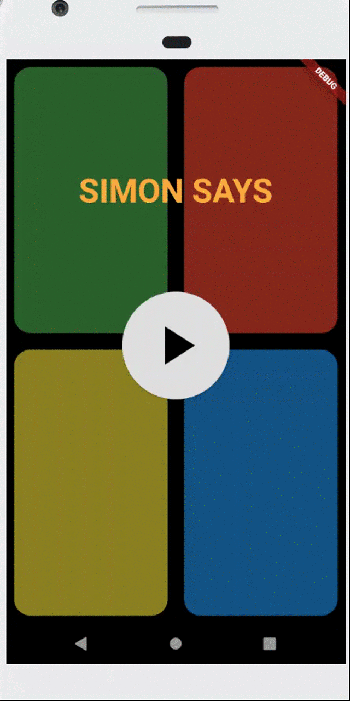

# Simon Says Game - Flutter version

Just to learn about StateManagement option in Flutter.

###  Preview 

  

## 🔌 Plugins Used
| Name | Usage |
|------|-------|
|[**Provider**](https://pub.dev/packages/provider)| State Management|
|[**Shared Preferences**](https://pub.dev/packages/shared_preferences)| Persistent store|